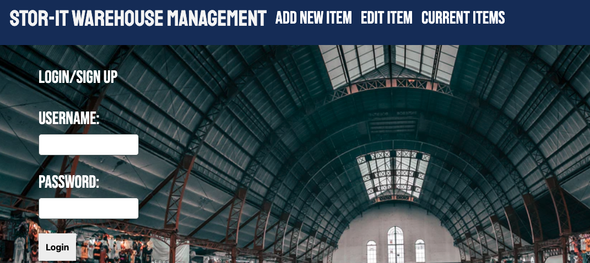

# STOR-IT-Warehouse-Management
Warehouse Management Application

  
  
  # Description
  A back-end application built using MySQL2, Express, Sequelize, Handlebars, dotenv, cloudinary and projected with Model View Controller (MVP).

  # Table of Contents 
  * [Installation](#installation)
  * [Usage](#usage)
  * [License](#license)
  * [Contributing](#contributing)
  * [Tests](#tests)
  * [Questions](#questions)
 
 Application Deployment 

 https://stor-it-warehouse-management.herokuapp.com/add/

 Application Screenshot

 

 

  
 
  # Installation
  The following necessary dependencies must be installed to run the application properly: 
  
  Clone the repo
 
  Install the dependecies: run "npm i"
  
  Run the server: "npm start"
  
  localhost:3001
  
  # Usage
  ​This application is used for
   
  This application allows you keep track of any items you please to keep in a storage. Could be at a storage unit, a warehouse, basement or garage. This will make it easier to know the item, the size, the exact location, its value and any comment on the shape of such item.

  # License
  This project is license under the MIT license.
  
  # Contributing
  ​Contributors: 
  This project was created by:

  Alex Alvarado : https://github.com/Alexjalva

  Carlos Castillo: https://github.com/ccastillo25

  Miguel Alcantar: https://github.com/malcan09

